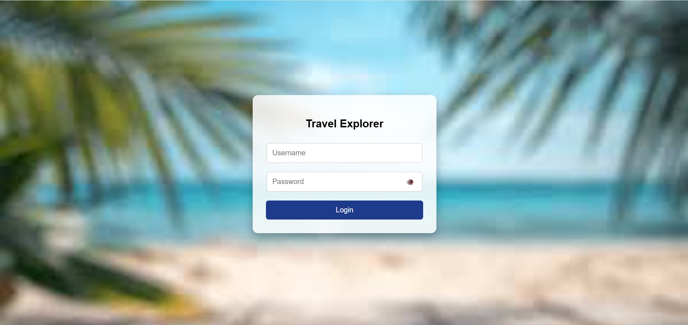
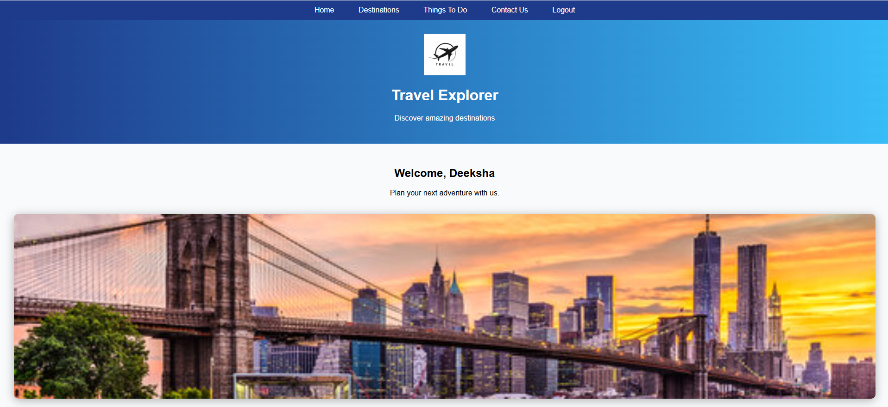
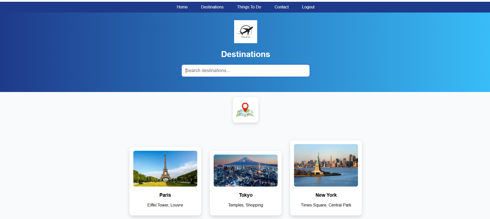
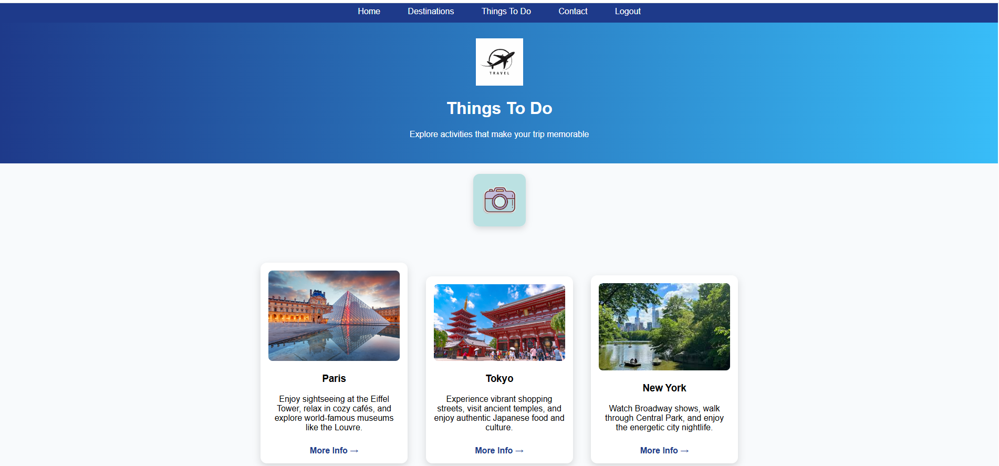
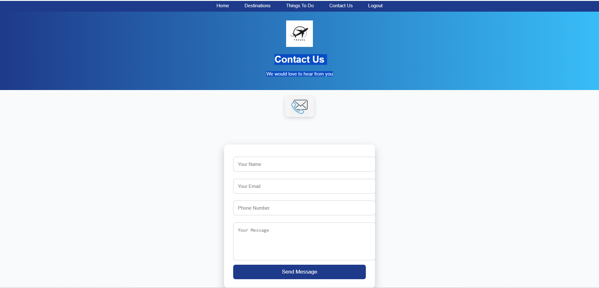

# Travel Explorer Website

## Live Demo
https://ldeeksha15.github.io/travel-explorer-website/

## Project Overview

Travel Explorer is a responsive travel web application that enables users to explore popular destinations, discover travel activities, and interact through a user-friendly interface. The application includes login authentication, destination search functionality, contact form validation, and dynamic user interactions using JavaScript.

## Key Features

- Login Authentication
- Show/Hide Password Functionality
- Destination Search and Filtering
- Travel Activity Recommendations
- Contact Form Validation
- Responsive User Interface
- Local Storage Session Management
- Personalized Welcome Message
- Logout Functionality

## Technologies Used

- HTML5
- CSS3
- JavaScript
- DOM Manipulation
- Local Storage
- GitHub Pages

## Project Highlights

- Developed a multi-page travel website with secure login functionality.
- Implemented dynamic destination search using JavaScript.
- Added client-side form validation for improved user experience.
- Designed a responsive and visually appealing interface.
- Deployed the application using GitHub Pages.

## 📸 Application Screenshots

### Login Page

Secure authentication page with username/password validation and show/hide password functionality.

---

### Home Page

Homepage featuring personalized welcome message, navigation menu, branding, and travel-themed hero banner.

---

### Destinations Page

Interactive destination discovery page with dynamic search functionality and destination filtering.

---

### Things To Do Page

Travel activity recommendations with destination-specific attractions, descriptions, and external information links.

---

### Contact Page

Contact form with input validation, phone number verification, and user feedback notifications.

## Skills Demonstrated

- Front-End Development
- Responsive Web Design
- JavaScript Programming
- DOM Manipulation
- Form Validation
- Local Storage Management
- UI/UX Design
- GitHub Deployment

## Conclusion

Travel Explorer Website is a responsive and interactive web application that enables users to explore destinations, discover travel activities, and engage through a user-friendly interface. The project highlights practical skills in HTML, CSS, JavaScript, DOM Manipulation, and web deployment.

